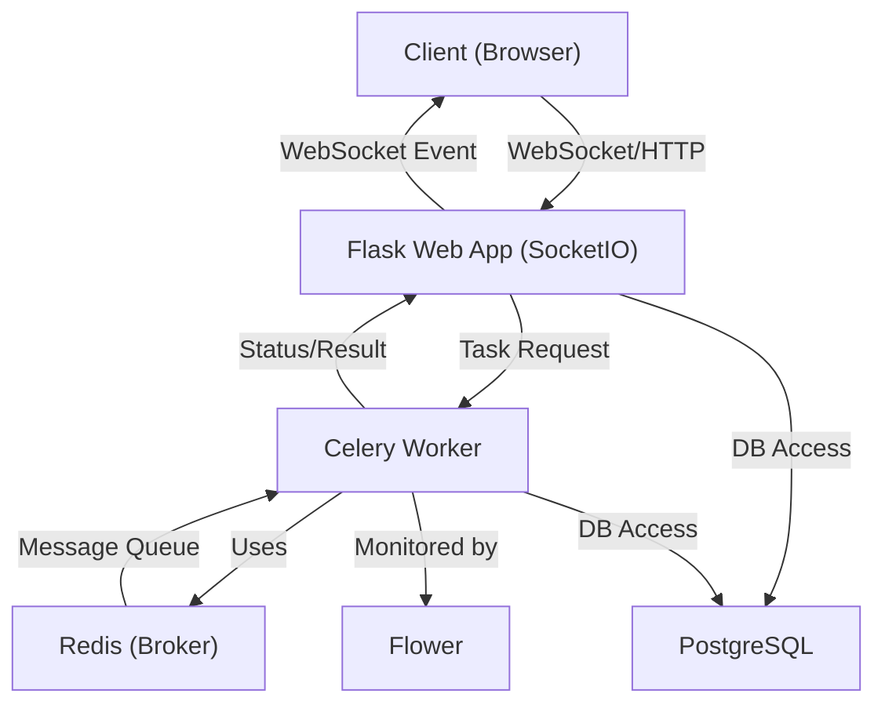
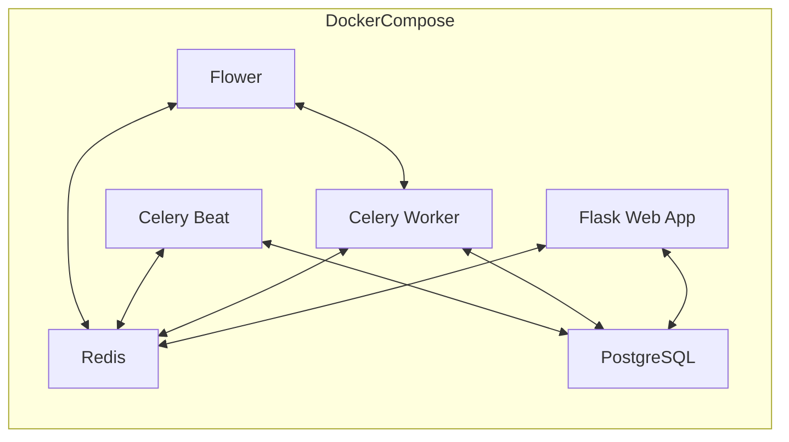
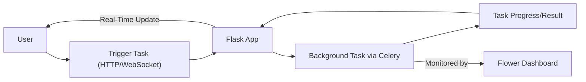
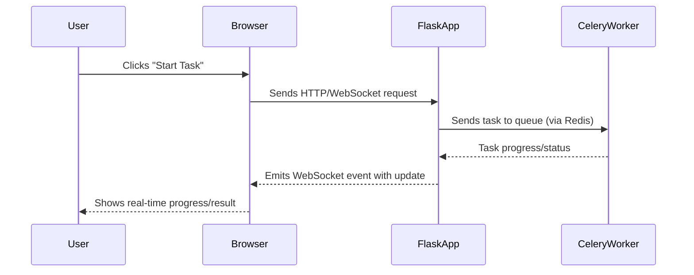
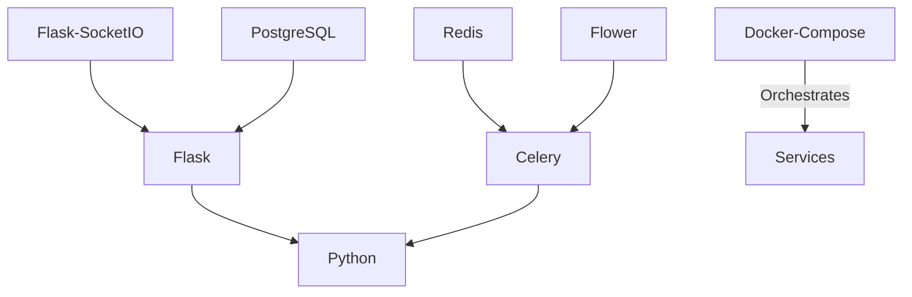

# Background Task Example with WebSocket, Flask, Redis, Celery, and Docker Compose

This repository provides a full-stack example project demonstrating how to run background tasks in a Flask web application using Celery, Redis, WebSockets (via Flask-SocketIO), and Docker Compose. It also includes monitoring with Flower and a PostgreSQL database.

## Features

- **Flask** web application
- **Celery** for background task processing
- **Redis** as the message broker
- **Flask-SocketIO** for real-time updates via WebSocket
- **Flower** for monitoring Celery tasks
- **PostgreSQL** database
- **Docker Compose** for simplified local development and orchestration

---

## WebSocket Integration

### How WebSocket is Used in This Project

This project uses **Flask-SocketIO** to enable real-time, bidirectional communication between the server and browser clients. The integration is visible in `app.py` and the project’s codebase, where a `socketio` server object is created and used to run the Flask app with WebSocket support. When background tasks are triggered and processed by Celery, the results or progress updates can be emitted to clients instantly over active WebSocket connections.

#### Key Points:
- The `socketio` object is initialized and runs the Flask app (see `app.py`).
- When a background task completes or has progress, the backend can emit events to the frontend through WebSocket.
- Clients connected via WebSocket receive real-time updates without needing to refresh or poll the server.

### Benefits of WebSocket in Background Task Processing

- **Real-Time Feedback:** Users can see the progress and results of background tasks immediately as they happen.
- **Reduced Latency:** Instant updates are pushed from server to client, eliminating the need for repeated polling.
- **Improved UX:** Users are kept informed about long-running operations, making the application more interactive and user-friendly.
- **Scalability:** Efficiently handles many concurrent connections, making it suitable for dashboards and monitoring tools.

### Example Use Cases for WebSocket Integration

- **Task Status Tracking:** Notify users when their requested background task (e.g., data processing, file upload/analysis, report generation) has started, is in progress, and is completed.
- **Progress Bars:** Update progress indicators in real-time as tasks make progress.
- **Live Notifications:** Push alerts or messages to users when tasks encounter errors or succeed.
- **Collaborative Apps:** Multiple users see updates as shared tasks progress (e.g., collaborative data analysis).
- **Dashboard Updates:** Admin or user dashboards reflect the live state of background processing queues, worker status, and results.

---
## System Architecture



---

## Container/Service Layout



---

## Feature Overview



---

## WebSocket Workflow



---

## Tools & Technologies


## Quick Start

### 1. Clone the Repository

```bash
git clone https://github.com/Jilan5/background-task-using-websocket-flask-redis-celery-docker-compose.git
cd background-task-using-websocket-flask-redis-celery-docker-compose/flask-celery-project
```

### 2. Set Up Environment Variables

Copy the sample environment file and adjust settings as needed:

```bash
cp env-project/.dev-sample env-project/.env
# Edit env-project/.env to customize your configuration (optional)
```

### 3. Build and Start Services

Make sure you have Docker and Docker Compose installed.

```bash
docker compose -f docker-compose.yml up --build
```

This will start the following containers:
- Flask web server (`web`)
- Celery worker (`celery_worker`)
- Celery beat scheduler (`celery_beat`)
- Flower monitoring dashboard (`flower`)
- Redis server (`redis`)
- PostgreSQL database (`db`)

---

## Accessing the Services

### Flask Web App

- URL: http://localhost:5010/
- You should see a "Hello, World!" message or the main app interface.

### Flower (Celery Monitoring)

- URL: http://localhost:5557/
- Use Flower to monitor Celery tasks, workers, and queues in real-time.

### WebSocket (Real-Time Updates)

- The Flask app is configured with Flask-SocketIO and eventlet to support real-time communication.
- You can test WebSocket features by implementing or triggering background tasks from the UI or API (see implementation for details).

---

## Example Workflow

1. **Trigger a Background Task**
    - Use an endpoint or UI action (to be implemented in the Flask app) to trigger a background task.
    - The task will be sent to Celery via Redis.

2. **Monitor Task Status**
    - Open Flower at http://localhost:5557/ to see the task appear and monitor its progress.

3. **Receive Real-Time Updates**
    - The Flask app will push updates to the client via WebSocket when the task status changes or completes.

---

## Stopping the Services

Press `Ctrl+C` in the terminal where Docker Compose is running, or:

```bash
docker compose -f docker-compose.yml down
```

---

## Project Structure

```
flask-celery-project/
├── app.py
├── project/              # Flask app and Celery integration
├── docker-compose.yml
├── requirements.txt
├── env-project/
│   ├── .dev-sample
│   └── .env
└── ...
```

---

## Customization & Development

- Modify or add endpoints in `app.py` and the `project/` directory.
- Define your Celery tasks in the appropriate module.
- Update `requirements.txt` as needed.

---

## Troubleshooting

- Ensure all ports (5010, 5557) are free before running.
- If you encounter issues, check logs with:
  ```bash
  docker compose logs
  ```

---

## References

- [Flask](https://flask.palletsprojects.com/)
- [Celery](https://docs.celeryq.dev/)
- [Flower](https://flower.readthedocs.io/)
- [Flask-SocketIO](https://flask-socketio.readthedocs.io/)
- [Docker Compose](https://docs.docker.com/compose/)

---

## License

This repository is intended as a template or learning resource. Add your own license as appropriate.

```
